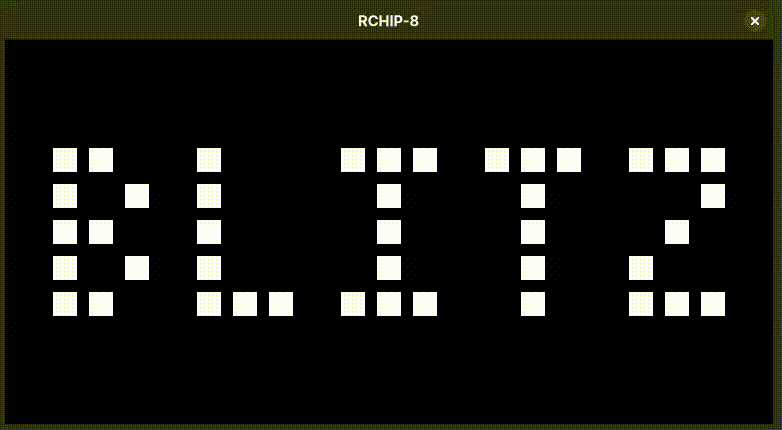

# RCHIP-8

Rubi's CHIP-8 emulator



## Key mapping

The CHIP-8 was built to be interpreted by a `COSMAC VIP` and, at the time, they didn't have that much of a keyboard for inputs.

All they had were 16 keys, from 0-F arranged in a grid. Most emulators map the keys to a grid on the left side of the keyboard. It's not very ergonomic, but gaming back then wasn't either.

 ~~Look at that random ass keyboard layout 😭😭~~

This emulator keeps a `1:1` mapping with your actual keyboard, being even less ergonomic than both the original hardware and other emulation systems. But that is temporary and I'll add a global configuration that includes your preferred key mapping as well as some suggestions based on common choices for directional input in games.

## Requirements

* `Linux`, `Mac` or `Windows` - Pretty much any version or distro will do.
* `Zig v0.17.0-dev.292+fc1c83a36` - Version `0.16.0` will probably work as well, but there is a `Docker` image with a complete toolchain coming soon to help you build the project.

## Build and Run

With the required tools installed, go ahead and run in your terminal:

``` bash
zig build run -Doptimize=ReleaseFast -- --rom "roms/Blitz [David Winter].ch8"
```

It will build the project and run the Blitz game.

## TODO's

- [ ] Configurable behavior.
  - [ ] Create configuration file.
  - [ ] Sprite clipping or wrapping as a configuration option.
  - [ ] Extract color code from command line args.
  - [ ] Configurable key mapping.
